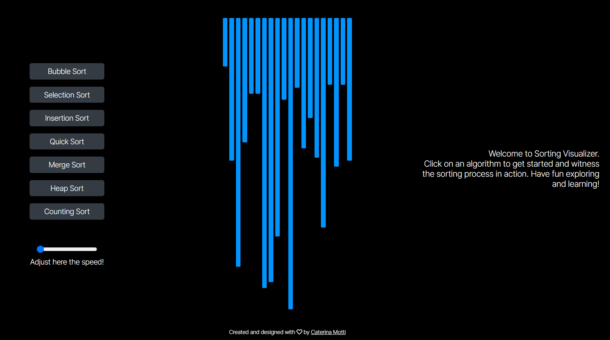

# Sorting Visualizer

Sorting Visualizer is a web application that allows you to visualize various sorting algorithms in action. It provides a visual representation of how different sorting algorithms work, making it an educational tool for understanding sorting techniques.
You can try it live [here](https://your-demo-link-here.com).

## Features

- Implemented algorithms:
  - Bubble Sort
  - Selection Sort
  - Insertion Sort
  - Quick Sort
  - Merge Sort
  - Heap Sort
  - Counting Sort
- Adjust the sorting speed to observe the algorithms at different paces.
- Randomize the input data for different sorting scenarios.
- Learn about each sorting algorithm's description and characteristics.
